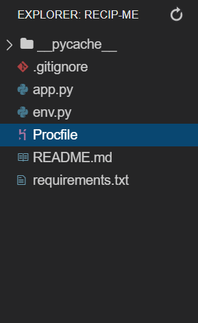
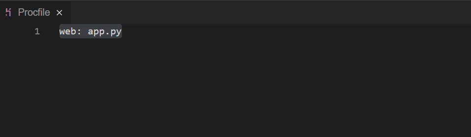
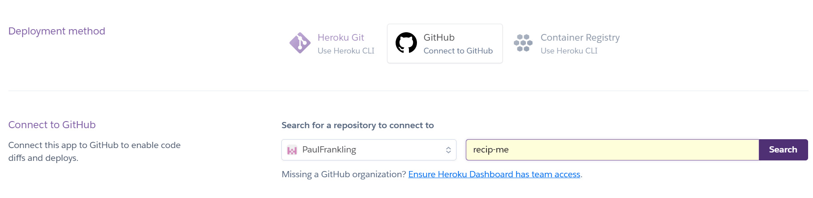
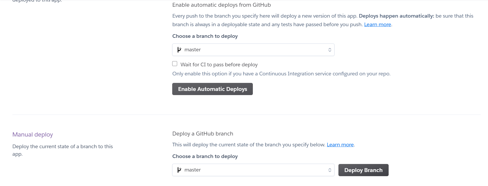

# RecipMe

## Code Institute - Milestone Project 3

[Click here to view my website](https://recipme-project.herokuapp.com/)

### User Experience (UX):

### Design:

### Wireframes:

### Technology used:

### Testing:

### Deployment:

This project was deployed by [Heroku](https://www.heroku.com/) through [GitHub](https://www.github.com/).

To begin with, the following files were added on the [Gitpod online IDE](https://www.gitpod.io/):

The **env.py** file is created to retain the environmental variables, and the **env.py** file needs to be added to the **.gitignore** file 
so these variables can't be pushed to GitHub.

#### Deployment Process:

1. After organising the **env.py**, **app.py** and **.gitignore** files, you need to add the **requirements.txt** file. 
   This file tells Heroku the dependencies required in running the project.

    To add this file and its dependencies, you need to input into the Command Line Interface(CLI):

    `pip3 freeze --local > requirements.txt`

1. Next the **Procfile** needs creating. This is what Heroku looks for to run the app and how to run it.

    To add this file, you need to input into the CLI:

    `echo web: python app.py`

    It is important the **Procfile** has an uppercase 'P' and any blank line added needs to be deleted as it 
    can cause problems running the app on Heroku. It should look like this:

    

1. After both the **Procfile** and **requirements.txt** file have been added and saved, sign in/sign up to [Heroku](https://www.heroku.com/) 
   and click on 'Create new app'.

1. Once you have created your new app, you need to go to the 'Deploy' section near the top of the page.

1. You now need to connect the Heroku app with your GitHub repository by firstly clicking on 'Connect to GitHub' as shown below:

    

1. Making sure your GitHub profile is displayed, add your repository into the box to the right of it and click 'Search'.

1. Once its found the repository, click 'Connect'.

1. Before clicking 'Enable Automatic Deploys', you need to go to the 'Settings' section on Heroku.

1. In the 'Settings' section you need to click 'Reveal Config Vars'. At this point, 
   you need to input all the environmental variables from the **env.py** file to tell Heroku which variables are required.

1. Once you have added the environmental variables and clicked 'Hide Config Vars', 
   you need to return to the [Gitpod online IDE](https://www.gitpod.io/) and push the **Procfile** and **requirements.txt** file to GitHub.

1. Once the files are pushed to GitHub, return to the 'Deploy' section on Heroku and click 'Enable Automatic Deploys' as shown below:

    

1. Then you need to click on 'Deploy Branch' and it will take a minute to build the app.

1. The app should now be deployed successfully and will update when code is pushed to GitHub. 
   You can open the app by selecting 'View' once its deployed. 

### Credits: