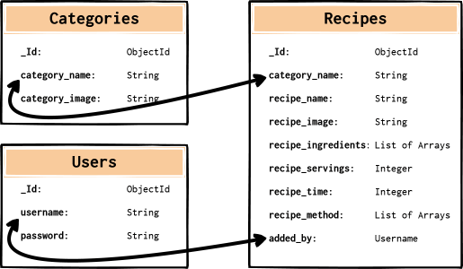

# RecipMe

## Code Institute - Milestone Project 3

[Click here to view my website](https://recipme-project.herokuapp.com/)

This website has been designed to the target the new, experienced and enthusiatic cooks of the world.
The website offers the user a chance to view various types of recipes, such as Breakfast or Dessert recipes.
As well as viewing recipes, the user can create an account and share recipes of their own. The user doesn't require
an account to view recipes and can use the search engine on the **recipes.html** page to find a particular recipe to try out.

## User Experience (UX):

* ### User Stories

  * #### First Time Visitor Goals

    * As a First Time Visitor, I want to understand the purpose of the website and view some of the recipes.
    * As a First Time Visitor, I want to easily navigate around the website.
    * As a First Time Visitor, I want to be able to easily create an account and sign in to it.
    * As a First Time Visitor, I want to be able to log out of my account once finished on the website.

  * #### Returning Visitor Goals

    * As a Returning Visitor, I want to be able to easily log in to my account.
    * As a Returning Visitor, I want to see if any new recipes have been added.
    * As a Returning Visitor, I would like to be able to find a particular recipe through the use of a search engine.

  * #### Frequent Visitor Goals

    * As a Frequent User, I want to be able to add and share a recipe of my own.
    * As a Frequent User, I would like to be able to edit my own recipes.
    * As a Frequent User, I want to be able to delete any of my recipes.
    * As a Frequent User, I'd like to visit the social media accounts through the links in the 
    footer to look for updates and interact with others on a public forum.

## Design:

### Colour Scheme

The colour scheme used for this project was generated on [Coolor](https://coolors.co/ffffff-e71d36-033f63).

* White `#FFFFFF`
* Rose Madder `#E71D36`
* Indigo Dye `#033F63`
* Cool Grey `#888DA7`

### Typography

I have chosen the font **Dancing Script** for my project title; RecipMe. I have also used this font for the headings on each page.
The font **Lato** has been chosen for all the content of the project. **Lato** was used for the content as it is much clearer than 
**Dancing Script** for the user. The fonts were both taken from [Google Fonts](https://fonts.google.com/specimen/Dancing+Script?query=dancing#standard-styles).

### Imagery

The website logo has been created on and styled on [Flaticon](https://www.flaticon.com/), which presents the welcoming image of a smiling Cook.

The strawberries image is taken from [Pixabay](https://pixabay.com/) and is used to suit the colour scheme of the website as well as present a healthy theme to the user.

For the home page, the category images have been taken from [Pixabay](https://pixabay.com/). The URL for each image has been inserted into the collections of categories on MongoDB in the *category_image* field.

The images for each recipe have been taken from [Allrecipes](https://www.allrecipes.com/). The URL for each image has been inserted into the collections of recipes on MongoDB in the *recipe_image* field.

## Development:

### Database Schema

[MongoDB](https://cloud.mongodb.com/) was used to create a non-relational database. 

The database is made up of three collections; Categories, Recipes and Users. 

## Wireframes:

* [Add Recipe Page Wireframe](https://github.com/PaulFrankling/recip_me/blob/master/static/docs/wireframes/add-recipe-wireframe.png)

* [Category Page Wireframe](https://github.com/PaulFrankling/recip_me/blob/master/static/docs/wireframes/category-wireframe.png)

* [Edit Recipe Page Wireframe](https://github.com/PaulFrankling/recip_me/blob/master/static/docs/wireframes/edit-recipe-wireframe.png)

* [Error Page Wireframes](https://github.com/PaulFrankling/recip_me/blob/master/static/docs/wireframes/error-wireframes.png)

* [Home Page Wireframe](https://github.com/PaulFrankling/recip_me/blob/master/static/docs/wireframes/home-wireframe.png)

* [Log In/Register Page Wireframe](https://github.com/PaulFrankling/recip_me/blob/master/static/docs/wireframes/register-login-wireframe.png)

* [Profile Page Wireframe](https://github.com/PaulFrankling/recip_me/blob/master/static/docs/wireframes/profile-wireframe.png)

* [Recipes Page Wireframe](https://github.com/PaulFrankling/recip_me/blob/master/static/docs/wireframes/recipes-wireframe.png)

* [Show Recipe Page Wireframe](https://github.com/PaulFrankling/recip_me/blob/master/static/docs/wireframes/show-recipe-wireframe.png)

## Features:

This is a mobile first, fully responsive website which was designed through the use of [Materialize](https://materializecss.com/).
The projects base template (`base.html`) presents the Navigation bar, Footer and Back to top button(Takes the user back to the top of each webpage) on all pages.
As well as these elements, it also implements the Mobile Side Navigation bar and any prompted Flash messages.

The Navigation bar presents the website logo of a Cook which links back to the Home page.

The Navigation bar can take the user directly to the Home page, Recipes page, Login page and Register page when the user isn't signed in.

The Navigation bar can take the user directly to the Home page, Recipes page, Add Recipe page and their Profile page when the user is signed in. As well as this, the Log out function is located on the Navigation bar.

The Footer has three social media icons and copyright information.

### Home Page 

The Home page presents the RecipMe heading and slogan.

The Home page presents two CTA buttons; Log In and Register, which when the user is signed out will takes the user to the chosen links.
If the user is signed in, the buttons change to Profile and Recipes that link to their respective pages.

Below the buttons, are category cards that the user can click on to view recipes belonging to its category. The user can do this signed in or signed out.

### Recipes Page

This page presents the user with a search engine to find any recipe that they might be interested in viewing.
By connecting to [MongoDB](https://cloud.mongodb.com/) through the CLI, an index was created.

> category_name, recipe_name and recipe_ingredients were selected for the index.

If a category name, recipe name or recipe ingredient is input into the search engine, then it will return an appropriate recipe associated with one of those objects.

If the database doesn't have what the user searched for, the page returns with 'No Results Found'. There is also a Reset button for the user to easily refresh their search.

### Register Page

This page allows the user to create an account. The user is required to only use either uppercase or lowercase letters and numbers when picking a username or password. It must also only be between 5-15 characters long.

If the user inputs a username already belonging to another user, a Flash message appears saying *"This username already exists!"*
When the user registers there account meeting all the requirements, it takes the user to their profile page and they receive a Flash message saying *"You have successfully registered with RecipMe!"*.

If the user already has an account, there is a link below the register form for the Log In page.

### Log In Page

This page logs the user into their account. The user must input their username and password correctly to access their account. 
If they input either one incorrectly then a Flash message appears saying *"Incorrect Username and/or Password!"*.
Once logged in, it takes the user to their profile page and says *"Hello (username)"*.

If the user hasn't got an account, there is a link below the Log In form for the Register page.

### Profile Page

The Profile page is the page the user is taken to when first registered or logged in. This page presents all the users added recipes.
If the user hasn't got any added recipes, the user is met with an "Add Recipe" button to prompt them to create one.

### Add Recipe Page

This page presents a form to the user in which they can create a recipe. The page is only accessible if the user is logged in.
The form has input fields to enter the recipe name, the recipes image URL, description, ingredients and method.
It also has three select fields; the category, time, and servings.

All input fields must be filled in apart from the image URL as the user may not have an image for the recipe. I have created a default image 
that appears on the image card when the user doesn't input anything in the image URL field [here](https://github.com/PaulFrankling/recip_me/blob/master/static/images/recipe-alt.png).

The category select field presents the options that belong to the category collection in [MongoDB](https://cloud.mongodb.com/); Breakfast, Starters, Mains, Sides, Desserts and Smoothies.
The time select field options range from 5 minutes to 120. If any more then I have finalised the options at 120+ minutes. The servings range from 1 - 20 serving(s).

The ingredients and method input fields can have multiple input fields added as the user most likely has more than one ingredient or step in their recipe.

The 'Add Recipe' button at the bottom will add the recipe when all requirements are met and the user will be redirected to the Recipes page with a Flash message saying *"Recipe successfully added!"*.

### Edit Recipe Page

The Edit Recipe page is laid out exactly like the Add Recipe page. This page is only accessible when signed in and when the user is on the page of a recipe added by them.

The input fields are prepopulated with the respective recipes information so it doesn't have to be completely refilled and it can be resubmitted easily once edited.

There is a cancel button below the submit button that cancels the edit and takes the user to the Recipes page. Once edited successfully, a Flash message appears saying "Recipe successfully updated!".

## Issues Overcome:

## Future features to implement:

* Pagination for all pages to provide a better UX.
* An option for user to save other peoples recipes to a favourites list.
* An option for the user to comment on other users recipes as well as receive feedback on their own.
* An option for the user to upload an image of their own instead of just a URL.

## Technology used:

### Programming Languages

* [HTML5](https://en.wikipedia.org/wiki/HTML5)
* [CSS3](https://en.wikipedia.org/wiki/CSS)
* [JavaScript](https://en.wikipedia.org/wiki/JavaScript)
* [Python](https://en.wikipedia.org/wiki/Python_(programming_language))

### Frameworks, Libraries and Programs

1. [Materialize](https://materializecss.com/) is used to form the layout of website and make it responsive. It is also used to add components to the website.
1. [Google Fonts](https://fonts.google.com/specimen/Dancing+Script?query=dancing#standard-styles) is used to implement the font **Dancing Script** for the headings and the font **Lato** for the content.
1. [Flaticon](https://www.flaticon.com/) was used to create and style a logo for the website.
1. [TinyPNG](https://tinypng.com/) is used to compress the imagery belonging to repository to improve speed of the website.
1. [Coolor](https://coolors.co/ffffff-e71d36-033f63) was used to help develop a colour scheme for the website.
1. [Font Awesome](https://fontawesome.com/) has been used to add icons to the website.
1. [Balsamiq](https://balsamiq.com/wireframes/desktop/) has been used to create the wireframes for the project and a Database Schema.
1. [Hover.css](https://ianlunn.github.io/Hover/) has been added to show a colour change on hover of a social media icon in the footer.
1. [jQuery](https://jquery.com/) was used to create navbar toggle functionality.
1. [Flask](https://flask.palletsprojects.com/en/1.1.x/) micro web framework was used to build the project.
1. [Jinja](https://jinja.palletsprojects.com/en/2.11.x/) is used for templating python into HTML.
1. [MongoDB](https://cloud.mongodb.com/) is a non-relational database used for the project.
1. [Git](https://git-scm.com/) was used for version control. Code produced in the Gitpod terminal was committed and pushed to GitHub.
1. [GitHub](https://github.com/) was used to store the project code pushed from Git.
1. [Heroku](https://dashboard.heroku.com/apps) was used to deploy the project.

## Testing:

## Deployment:

This project was deployed by [Heroku](https://www.heroku.com/) through [GitHub](https://www.github.com/).

To begin with, the following files were added on the [Gitpod online IDE](https://www.gitpod.io/):

The **env.py** file is created to retain the environmental variables, and the **env.py** file needs to be added to the **.gitignore** file 
so these variables can't be pushed to GitHub.

### Deployment Process:

1. After organising the **env.py**, **app.py** and **.gitignore** files, you need to add the **requirements.txt** file. 
   This file tells Heroku the dependencies required in running the project.

    To add this file and its dependencies, you need to input into the Command Line Interface(CLI):

    `pip3 freeze --local > requirements.txt`

1. Next the **Procfile** needs creating. This is what Heroku looks for to run the app and how to run it.

    To add this file, you need to input into the CLI:

    `echo web: python app.py`

    It is important the **Procfile** has an uppercase 'P' and any blank line added needs to be deleted as it 
    can cause problems running the app on Heroku. It should look like this:

    

1. After both the **Procfile** and **requirements.txt** file have been added and saved, sign in/sign up to [Heroku](https://www.heroku.com/) 
   and click on 'Create new app'.

1. Once you have created your new app, you need to go to the 'Deploy' section near the top of the page.

1. You now need to connect the Heroku app with your GitHub repository by firstly clicking on 'Connect to GitHub' as shown below:

    

1. Making sure your GitHub profile is displayed, add your repository into the box to the right of it and click 'Search'.

1. Once its found the repository, click 'Connect'.

1. Before clicking 'Enable Automatic Deploys', you need to go to the 'Settings' section on Heroku.

1. In the 'Settings' section you need to click 'Reveal Config Vars'. At this point, 
   you need to input all the environmental variables from the **env.py** file to tell Heroku which variables are required.

1. Once you have added the environmental variables and clicked 'Hide Config Vars', 
   you need to return to the [Gitpod online IDE](https://www.gitpod.io/) and push the **Procfile** and **requirements.txt** file to GitHub.

1. Once the files are pushed to GitHub, return to the 'Deploy' section on Heroku and click 'Enable Automatic Deploys' as shown below:

    

1. Then you need to click on 'Deploy Branch' and it will take a minute to build the app.

1. The app should now be deployed successfully and will update when code is pushed to GitHub. 
   You can open the app by selecting 'View' once its deployed. 

## Credits:

### Code

* [Task Manager](https://github.com/Code-Institute-Solutions/TaskManagerAuth) project from [Code Institute](https://codeinstitute.net/) was used to help develop my own project.
* [Stack Overflow](https://stackoverflow.com/questions/19414856/how-can-i-make-all-images-of-different-height-and-width-the-same-via-css) was used to help with the equal sizing of the category and recipe card images.
* [Stack Overflow](https://stackoverflow.com/questions/37127123/change-color-of-underline-input-and-label-in-materialize-css-framework/37127156) was used to help target the Materialize form fields when selected and change their colours on `focus`.
* [Sanwebe](https://www.sanwebe.com/2013/03/addremove-input-fields-dynamically-with-jquery) was used to help add an extra input field for the user to add more than one item to the ingredients or method section.
* [Squarespace](https://forum.squarespace.com/topic/190117-back-to-top-button-make-it-appeardisappear-on-scroll/) was used to help with the scroll to top feature of the back to top button and to appear when scrolling down the screen.

### Content

All recipes were taken from [Allrecipes](https://www.allrecipes.com/)

* [PBJ French Toast](https://www.allrecipes.com/recipe/239317/pbj-french-toast/)
* [Perfect Breakfast](https://www.allrecipes.com/recipe/221304/perfect-breakfast/)
* [Honey Nut Granola](https://www.allrecipes.com/recipe/21208/honey-nut-granola/)
* [Easy Bruschetta](https://www.allrecipes.com/recipe/14838/easy-bruschetta/)
* [Sweet Potato Rosti](https://www.allrecipes.com/recipe/182097/sweet-potato-rosti/)
* [California Turkey Burger](https://www.allrecipes.com/recipe/247314/california-turkey-burger/)
* [Italian Baked Meatballs](https://www.allrecipes.com/recipe/268249/italian-baked-meatballs/)
* [Asparagus Carbonara](https://www.allrecipes.com/recipe/279162/asparagus-carbonara/)
* [Zucchini and Blue Cheese Side](https://www.allrecipes.com/recipe/206304/zucchini-and-blue-cheese-side/)
* [Sauteed Summer Squash Side Dish](https://www.allrecipes.com/recipe/274646/sauteed-summer-squash-side-dish/)
* [Dessert Yogurt Protein Bowl](https://www.allrecipes.com/recipe/267252/dessert-yogurt-protein-bowl/)
* [Key Lime Pie Mini Dessert](https://www.allrecipes.com/recipe/269876/key-lime-pie-mini-dessert/)
* [Healthy Pumpkin Cranberry Muffins](https://www.allrecipes.com/recipe/232460/healthy-pumpkin-cranberry-muffins/)
* [Strawberry Blueberry Smoothies](https://www.allrecipes.com/recipe/223140/strawberry-blueberry-smoothies/)
* [Ultimate Fruit Smoothie](https://www.allrecipes.com/recipe/236204/ultimate-fruit-smoothie/)

> This project was created for educational purposes only.

### Media Used

* The background image of strawberries on **all pages** is by Nietjuh from [Pixabay](https://pixabay.com/photos/strawberries-red-fruit-fruit-red-4417296/).

#### Category images

* The Breakfast image is by Aline Ponce from [Pixabay](https://pixabay.com/photos/eggs-fried-sunny-side-up-sandwich-1467284/).
* The Starters image is by silviarita from [Pixabay](https://pixabay.com/photos/carrot-soup-bread-herbs-oil-soup-2192152/).
* The Mains image is by Free-Photo from [Pixabay](https://pixabay.com/photos/food-meal-soup-dish-peppers-spicy-1209007/).
* The Sides image is by  Jason Goh from [Pixabay](https://pixabay.com/photos/water-spinach-kangkong-sambal-chilli-1628620/).
* The Desserts image is by gefrorene_wand from [Pixabay](https://pixabay.com/photos/dessert-milk-product-delicious-1647468/).
* The Smoothies image is by NielsBB from [Pixabay](https://pixabay.com/photos/fruit-dessert-food-drink-snack-3222313/).

#### Acknowledgements

* Many thanks to my Mentor; Gurjot Singh, who helped greatly. He offered lots of advice, potential ideas and solutions.
* Many thanks to Code Institute tutor support for their quick responses and guidance in solving any issues. A particular mention 
to Igor Basuga, Kevin Loughrey and Tim Nelson. 
* Many thanks to the Slack community for helping me understand certain aspects of the project.