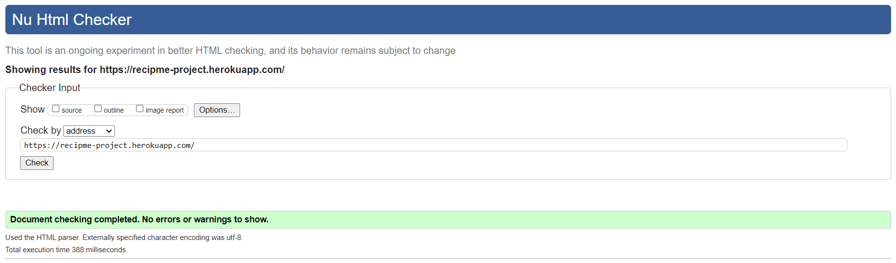
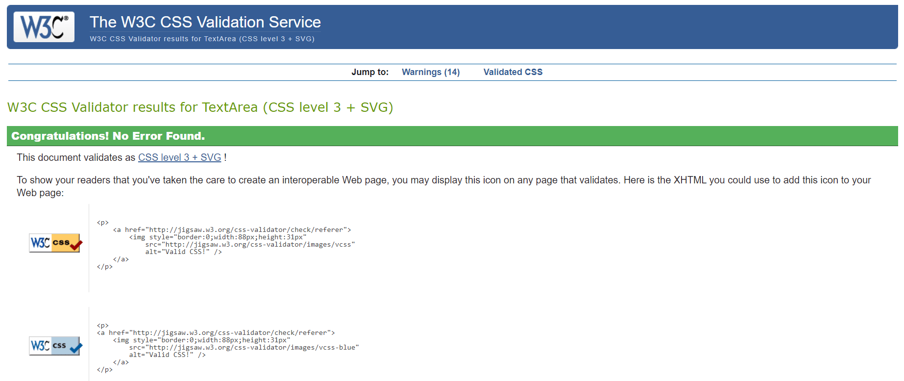
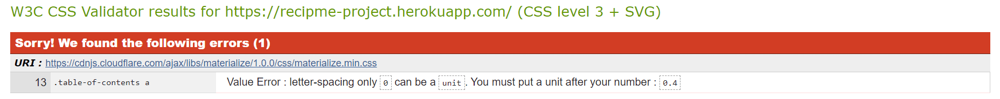
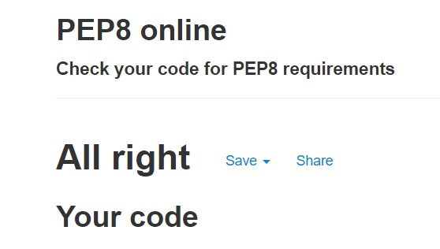

## Testing

### Validation:

#### HTML

[W3C Markup Validation](https://validator.w3.org/#validate_by_uri) was used to validate the projects HTML code through its URI.
Validating through the URI produced no errors as shown below:

Each HTML page was also validated through the use of the [direct input](https://validator.w3.org/#validate_by_input) option. 
Warnings and Errors were only produced for each of the 12 HTML pages due to the use of Jinja.

#### CSS

[W3C CSS Validation](https://jigsaw.w3.org/css-validator/#validate_by_input) was used to validate the `style.css` file through direct input.
By inputting my own CSS, the validator found no errors as shown below:

The CSS of the project was also validated through its URI. By doing so, it did produce one error. This error though is due to Materialize and not an error from my own CSS.

#### JavaScript

[JShint](https://jshint.com/) was used to validate both my JavaScript files; `scripts.js` and `topButton.js`. Both JavaScript files came back with no errors.
The only thing brought to attention was that the `scripts.js` file needed two semi colons added and they have been implemented.

#### Python

### Testing of User Stories in UX section of [README.md](https://github.com/PaulFrankling/recip_me#readme):

  * #### First Time Visitor Goals

    * *As a First Time Visitor, I want to understand the purpose of the website and view some of the recipes.*

      1. On first view of the website, the user is taken to the Home page and can easily view recipes from the selection of recipe categories as well as visiting the Recipes page to view all the recipes.

    * *As a First Time Visitor, I want to easily navigate around the website.*

      1. The user can easily find each page through the navigation bar. The logo at the top left of the website always directs the user to the Home page.

    * *As a First Time Visitor, I want to be able to easily create an account and sign in to it.*

      1. The user can easily create an account by visiting the Register page by either using the navigation bar or using the CTA button on the Home page.
      1. The user has clear instructions on the requirements needed to create an account successfully below the Username and Password input fields.

    * *As a First Time Visitor, I want to be able to log out of my account once finished on the website.*

      1. The user can log out from their account at anytime by clicking 'Log Out' on the navigation bar.

  * #### Returning Visitor Goals

    * *As a Returning Visitor, I want to be able to easily log in to my account.*

      1. The user can easily log in to their account by visiting the Login page and inputting their accounts Username and Password.

    * *As a Returning Visitor, I want to see if any new recipes have been added.*

      1. The user can see if any new recipes are added by visiting the Recipes page.
      1. The user can also see new recipes by looking at the categories on the Home page.

    * *As a Returning Visitor, I would like to be able to find a particular recipe through the use of a search engine.*

      1. The user can view recipes through the use of the search bar on the Recipes page.
      1. The user can view recipes by category name, recipe name or recipe ingredients, giving the user a better chance to find something specific to their taste.

  * #### Frequent Visitor Goals

    * *As a Frequent User, I want to be able to add and share a recipe of my own.*

      1. The user when registered and logged in can add a recipe by visiting the Add Recipe page from the navigation bar.

    * *As a Frequent User, I want easily find my added recipes via the Profile page.*

      1. Everytime the user adds a recipe, it is added to their Profile page to view any time.

    * *As a Frequent User, I would like to be able to edit my own recipes.*

       1. When viewing their own recipe, the user has the option to edit their recipe by clicking on the 'Edit Recipe' button and they're then directed to the Edit Recipe page to be able to edit it.

    * *As a Frequent User, I want to be able to delete any of my recipes.*

       1. When viewing their own recipe, the user has the option to delete their recipe by clicking on the 'Delete Recipe' button. The user is then met with a Modal offering them a chance to change their mind and select 'No', or choose to go ahead with the deletion by selecting 'Yes'.

    * *As a Frequent User, I'd like to visit the social media accounts through the links in the 
    footer to look for updates and interact with others on a public forum.*

       1. The user has the option to visit social media accounts through the icons on the footer of the website.