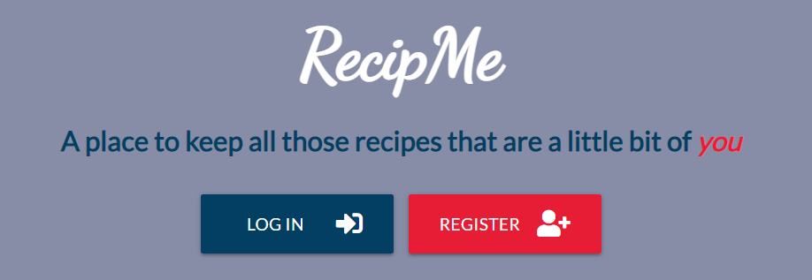
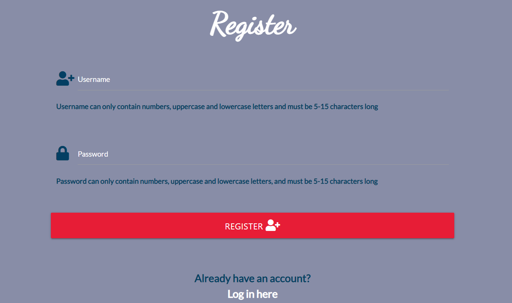

## Testing

### Validation:

#### HTML

[W3C Markup Validation](https://validator.w3.org/#validate_by_uri) was used to validate the projects HTML code through its URI.
Validating through the URI produced no errors as shown below:

Each HTML page was also validated through the use of the [direct input](https://validator.w3.org/#validate_by_input) option. 
Warnings and Errors were only produced for each of the 12 HTML pages due to the use of Jinja.

#### CSS

[W3C CSS Validation](https://jigsaw.w3.org/css-validator/#validate_by_input) was used to validate the `style.css` file through direct input.
By inputting my own CSS, the validator found no errors as shown below:

The CSS of the project was also validated through its URI. By doing so, it did produce one error. This error though is due to Materialize and not an error from my own CSS.

#### JavaScript

[JShint](https://jshint.com/) was used to validate both my JavaScript files; `scripts.js` and `topButton.js`. Both JavaScript files came back with no errors.
The only thing brought to attention was that the `scripts.js` file needed two semi colons added and they have been implemented.

#### Python

### Testing of User Stories in UX section of [README.md](https://github.com/PaulFrankling/recip_me#readme):

  * #### First Time Visitor Goals

    * *As a First Time Visitor, I want to understand the purpose of the website and view some of the recipes.*

      * **On first view of the website, the user is taken to the Home page and can easily view recipes from the selection of recipe categories as well as visiting the Recipes page to view all the recipes.**

      

    * *As a First Time Visitor, I want to easily navigate around the website.*

      * **The user can easily find each page through the navigation bar. The logo at the top left of the website always directs the user to the Home page.**

      

    * *As a First Time Visitor, I want to be able to easily create an account and sign in to it.*

      * **The user can easily create an account by visiting the Register page by either using the navigation bar or using the CTA button on the Home page.**

      

      * **The user has clear instructions on the requirements needed to create an account successfully below the Username and Password input fields.**

      

    * *As a First Time Visitor, I want to be able to log out of my account once finished on the website.*

      * **The user can log out from their account at anytime by clicking 'Log Out' on the navigation bar.**

      

  * #### Returning Visitor Goals

    * *As a Returning Visitor, I want to be able to easily log in to my account.*

      * **The user can easily log in to their account by visiting the Login page and inputting their accounts Username and Password.**

      

    * *As a Returning Visitor, I want to see if any new recipes have been added.*

      * **The user can see if any new recipes are added by visiting the Recipes page.**
      * **The user can also see new recipes by looking at the categories on the Home page.**

    * *As a Returning Visitor, I would like to be able to find a particular recipe through the use of a search engine.*

      * **The user can view recipes through the use of the search bar on the Recipes page.**

      

      * **The user can view recipes by category name, recipe name or recipe ingredients, giving the user a better chance to find something specific to their taste.**

  * #### Frequent Visitor Goals

    * *As a Frequent User, I want to be able to add and share a recipe of my own.*

      * **The user, when registered and logged in, can add a recipe by visiting the Add Recipe page from the navigation bar.**

      

    * *As a Frequent User, I want easily find my added recipes via the Profile page.*

      * **Every time the user adds a recipe, it is added to their Profile page to view any time.**

      

    * *As a Frequent User, I would like to be able to edit my own recipes.*

       * **When viewing their own recipe, the user has the option to edit their recipe by clicking on the 'Edit Recipe' button and they're then redirected to the Edit Recipe page to be able to edit it.**

       

    * *As a Frequent User, I want to be able to delete any of my recipes.*

       * **When viewing their own recipe, the user has the option to delete their recipe by clicking on the 'Delete Recipe' button. 
       The user is then met with a Modal offering them a chance to change their mind and select 'No', or choose to go ahead with the deletion by selecting 'Yes'.**

        
       
       

    * *As a Frequent User, I'd like to visit the social media accounts through the links in the 
    footer to look for updates and interact with others on a public forum.*

       * **The user has the option to visit social media accounts through the icons on the footer of the website.**

       

### Testing Process

The projects responsiveness was established through the framework [Materialize](https://materializecss.com/).
The project was tested on numerous devices and presented no responsiveness issues.

The website was thoroughly tested and a detailed account of each tested feature is documented below:

#### Navigation Bar

* All navigation bar links were tested one by one and worked properly. &check;
* The website logo correctly redirects the user to the Home page. &check;
* The log out function works correctly and redirects the user to the Login page as expected. &check;
* The mobile side navigation bar redirects the user to each page correctly. &check;

#### Flash Messages

* All Flash messages appear after the appropriate action is taken:

  * User registers an account: "You have successfully registered with RecipMe!". &check;
  * User logs into their account: "Hello { username }!". &check;
  * User logs out of their account: "You have successfully logged out!". &check;
  * User inputs an username that already exists: "This username already exists!". &check;
  * User incorrectly inputs the wrong username or password when logging in: "Incorrect Username and/or Password!". &check;
  * User successfully adds a recipe: "Recipe successfully added!". &check;
  * User successfully edits a recipe: "Recipe successfully updated!". &check;
  * User successfully deletes a recipe: "Recipe successfully deleted!". &check;

#### Footer

* If the user clicks on any of the social media links in the footer, they are taken to that respective social media site on a new tab whilst retaining RecipMe on the previous tab. &check;
* The circular background of the social media icons turn `#033F63` when they are hovered over. &check;

#### Back to Top Button

* The button takes the user to the top of the page and fades in and out when scrolling up and down the screen. &check;

#### Home Page

* When the user is logged out, the 'Log In' and 'Register' CTA buttons both redirect the user to their respective pages. &check;
* When the user is logged in, the 'Profile' and 'Recipes' CTA buttons both redirect the user to their respective pages. &check;
* Each category card on the Home page takes the user to the correct respective category. &check;

#### Category Page

* When the user selects any of the recipe categories on the Home page, the correct recipes belonging to that category show on its particular category page. &check;
* Any added recipes appear on its particular category page. &check;

#### Recipes Page

The Recipes page has a search engine and as mentioned in the [README.md](https://github.com/PaulFrankling/recip_me#readme), the indexes created with [MongoDB](https://cloud.mongodb.com/) were category_name, recipe_name and recipe_ingredients.

* All categories were searched and all came back with the correct results. &check;
* Numerous recipes were searched and the appropriate results came back. &check;
* Searched 10 different ingredients which and the search engine returned the correct recipes with those ingredients. &check;
* If the search engine can't find the requested search query, it correctly returns a "No Results Found" message. &check;
* Reset button works correctly by resetting the search query. &check;

#### Register Page

* Input fields correctly notifies the user if the Username or Password is too short or contains a symbol. &check;
* Login page link works correctly. &check;
* When user registers their account, it adds their credentials to [MongoDB](https://cloud.mongodb.com/). 
It shows the Username of each user but hashes the Password with the use of Werkzeug. &check;
* Once registered, it correctly takes the user to their Profile page. &check;

#### Login Page

* Input fields works correctly by resetting the page when the user incorrectly inputs the wrong login details. &check;
* When the user logs in, it correctly takes the user to their Profile page. &check;
* Register page link works correctly. &check;

#### Profile Page

* The Profile page correctly shows the logged in accounts Username in the page title. &check;
* If the user has just registered or hasn't added any recipes, the page correctly shows an 'Add Recipe' CTA button. &check;
* When the user adds a recipe, it removes the 'Add Recipe' CTA button as expected. &check;
* The Profile page just the recipes the user has added and no other users. &check;

#### Add Recipe Page

#### Edit Recipe Page

#### Show Recipe Page